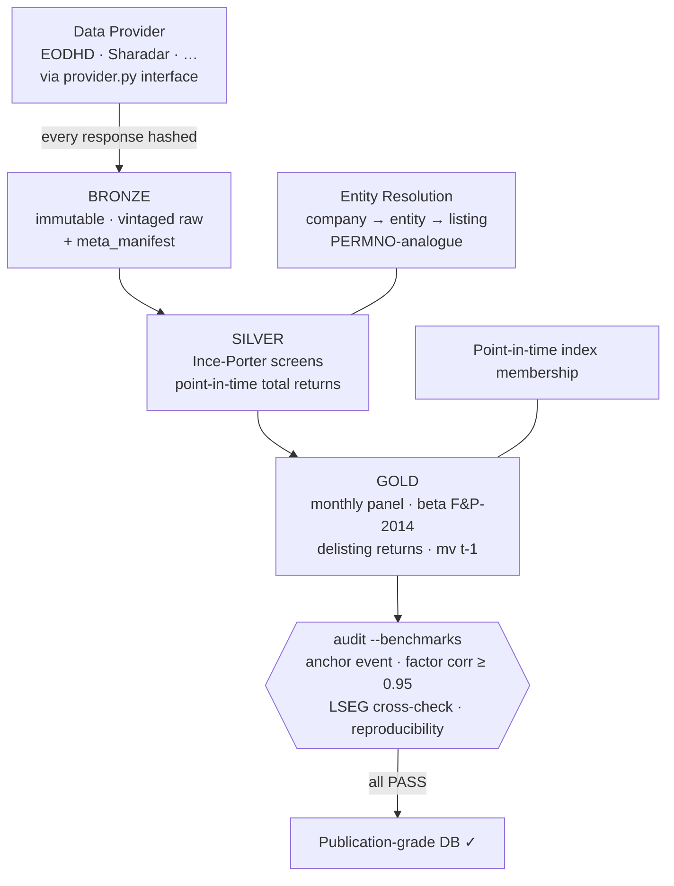

<div align="center">

# 🏛️ HyperDB

### A Reproducible Open Pipeline for Publication-Grade Global Equity Data

*Bring your own API key. Run the pipeline. Get a clean, survivorship-bias-free,
point-in-time-correct global equity database — and a benchmark suite that proves it.*


University of Konstanz · 2026

</div>

---

> **Honesty first.** HyperDB is shipped as a **pipeline, not a dataset**. No vendor data is
> distributed here. The database is *regenerated* by whoever runs the pipeline with their own
> data-provider key. Empirical numbers (coverage, distributions, validation results) are
> produced **by the build** and are **not claimed in this README** — they appear in
> auto-generated reports after you run it. Nothing here asserts a result that does not yet exist.

## Why this exists

Empirical asset pricing lives or dies by data quality. The gold standards — CRSP, Compustat,
Refinitiv, Bloomberg — are expensive and access-restricted. HyperDB is a **transparent,
reproducible alternative**: every cleaning rule is explicit, referenced to the literature, and
verifiable; every result is pinned to an immutable data snapshot. The goal is not "as good as
Bloomberg" (it is not) — it is **publication-defensible with documented limitations**, the
accepted standard for Datastream-class data in published research.

The hard part is not the code. It is making the *data* trustworthy: no survivorship bias, no
look-ahead, no silent gaps, and — hardest of all — correct **identity** through ticker changes
and reuse (the problem CRSP solves with PERMNO). HyperDB confronts each of these head-on; see
**[Threats to Validity](docs/THREATS_TO_VALIDITY.md)** and
**[Entity Resolution](docs/ENTITY_RESOLUTION.md)**.

## Pipeline at a glance



## What makes it academically defensible

| Pillar | Threat countered | Reference |
|---|---|---|
| Active **+ delisted** universe; **delisting returns** | survivorship bias | Shumway (1997) |
| **Point-in-time total returns** from raw close+div+splits | retroactive-adjustment look-ahead | — |
| **Availability-lagged factors** + COVID anchor test | the one-month misalignment bug | GPA-CF lesson |
| **Static + dynamic screens** | bad ticks, reversals, sentinels, non-common equity | Ince & Porter (2006) |
| **HyperID** entity model | ticker reuse/change, cross-listing, share class | CRSP PERMNO analogue |
| `mv[t-1]` weighting; PIT index membership; reporting lags | look-ahead | Bali-Engle-Murray (2016) |
| **Immutable vintaged Bronze** + manifests + hashes | non-reproducibility, vendor revision | Chen & Zimmermann |

Full register: **[docs/THREATS_TO_VALIDITY.md](docs/THREATS_TO_VALIDITY.md)**.

## Quickstart (bring your own key)

```bash
pip install -r requirements.txt
cp config/settings.example.yaml config/settings.yaml   # gitignored; add YOUR api.token + paths
python cli.py universe            # active + delisted instruments
python cli.py download smart      # ~5 days, API-rate-bound, resumable
python cli.py calendar            # real exchange calendars
python cli.py transform screen    # Ince-Porter screens
python cli.py transform total-return
python cli.py transform clean delisting panel factors-align
python cli.py audit --full --benchmarks   # the publication-grade gate
```

Full contract and acceptance criteria: **[docs/REPRODUCE.md](docs/REPRODUCE.md)**.

## Documentation

| Doc | Purpose |
|---|---|
| [ARCHITECTURE_V2.md](docs/ARCHITECTURE_V2.md) | Module-level design & build DAG |
| [REPRODUCE.md](docs/REPRODUCE.md) | BYO-key reproduction + machine-checkable acceptance criteria |
| [THREATS_TO_VALIDITY.md](docs/THREATS_TO_VALIDITY.md) | Every way the work could be devalued — and the countermeasure |
| [ENTITY_RESOLUTION.md](docs/ENTITY_RESOLUTION.md) | The PERMNO problem and the HyperID solution |
| [METHODOLOGY.md](docs/METHODOLOGY.md) | Every rule + threshold + reference *(filled during build)* |
| [DATA_DICTIONARY.md](docs/DATA_DICTIONARY.md) | Every table/column/unit/source *(filled during build)* |
| [LIMITATIONS.md](docs/LIMITATIONS.md) | Honest limitations register *(quantified after build)* |
| [DECISIONS.md](docs/DECISIONS.md) | Decision log with before/after evidence |
| [VALIDATION_REPORT.md](docs/VALIDATION_REPORT.md) | Auto-generated suite results per vintage *(empty until built)* |
| [COVERAGE_REPORT.md](docs/COVERAGE_REPORT.md) | Coverage & distribution transparency *(generated by the build)* |

## Storage architecture

Medallion: **Bronze** (immutable, vintaged raw) → **Silver** (cleaned, screened, PIT returns) →
**Gold** (analysis-ready monthly panel). Plus **Dim** (entity/company/listing, exchange,
calendar, index membership) and **Meta** (manifests, vintages, download log). Schema in
`src/core/db.py`; deltas vs the prior build in [ARCHITECTURE_V2.md](docs/ARCHITECTURE_V2.md).

## Requirements

Python 3.11+, DuckDB 1.0+; `duckdb pandas numpy pyyaml tqdm requests scipy matplotlib`
(+ `pandas-market-calendars` for real calendars). A data-provider subscription (EODHD All-World
by default) and ~150–300 GB of journaled storage (APFS/ext4/NTFS — **not** non-journaled exFAT).

## Note on AI usage

Pipeline design and quality-assurance procedures were developed with assistance from Claude
(Anthropic). All code, methodology, and validation logic are reviewed and verified by the
author. Database contents derive exclusively from the user's chosen providers (EODHD, Kenneth
French Data Library, Global-Q, FRED).

## References

- Ince, O. & Porter, R. B. (2006). *Individual Equity Return Data from Thomson Datastream:
  Handle with Care!* Journal of Financial Research, 29(4).
- Shumway, T. (1997). *The Delisting Bias in CRSP Data.* Journal of Finance, 52(1).
- Frazzini, A. & Pedersen, L. H. (2014). *Betting Against Beta.* JFE, 111(1).
- Fama, E. F. & French, K. R. (1993, 2015). *Common risk factors; A five-factor model.* JFE.
- Hou, K., Xue, C., & Zhang, L. (2015). *Digesting Anomalies.* RFS, 28(3).
- Bali, Engle & Murray (2016). *Empirical Asset Pricing.* Wiley.
- Chen, A. & Zimmermann, T. *Open Source Cross-Sectional Asset Pricing.*
